# 📊 20년차 데이터 분석가: 쇼핑 트렌드 EDA 리포트
**부제: '선풍기'와 '핫팩'의 1년 주기 탐색적 데이터 분석**

- 발표자: (20년차 데이터 분석가)
- 프로젝트: 네이버 오픈 API 기반 쇼핑 인사이트 
- 분석 데이터 기간: 최근 1년 (약 364일)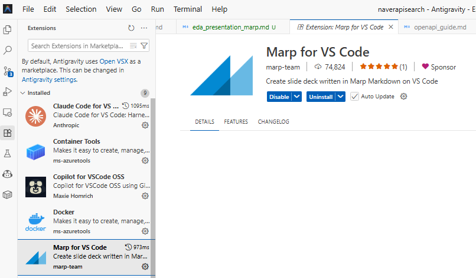
- 대상 상품군: 선풍기(여름 시즌성), 핫팩(겨울 시즌성)

---

# 📝 1. 목차 (Index)

1. **프로젝트 개요 및 목적**
2. **분석 데이터 (구조 및 통계)**
3. **일변량 데이터 분석 및 시각화**
4. **범주형 빈도 분석 플롯**
5. **시계열 시각화 분포도**
6. **상관 분석 및 이변량 박스플롯**
7. **다변량 교차 비교 및 듀얼 크로스 차트**
8. **비즈니스 인사이트 및 마케팅 전략 요약**

---

# 2. 데이터 기본 정보 파악

### 📌 데이터 상하위 주요 샘플 확인

| 조회 일자 | 선풍기 비율 | 핫팩 비율 | 월 | 요일 | 계절 |
|:----------|:---|:---|:---|:---|:---|
| (Top) 25-03-21 | 4.08 | 5.21 | 3 | Friday | 봄 |
| 25-03-22 | 5.32 | 2.88 | 3 | Saturday | 봄 |
| ... | ... | ... | ... | ... | ... |
| 26-03-18 | 1.08 | 4.26 | 3 | Wednesday | 봄 |
| (Bottom) 26-03-19 | 1.14 | 4.42 | 3 | Thursday | 봄 |

*파이프라인을 통과한 선풍기와 핫팩 데이터의 상대 비율(0~100) 테이블 추출 완료.*

---

# 3. 데이터 품질 및 구조 파악 (.info)

### 🧐 구조적 요약 및 결측치 현황
- **전체 행(Rows)의 수**: 364행 (1년치 데일리 시계열)
- **전체 열(Cols)의 수**: 6열 (비율 2개, 파생 변수 3개)
- **중복 데이터의 수**: 0개 (Clean DataFrame 입증)

> 💡 *결측치나 결함 데이터가 없는 완벽한 정형(Structured) 데이터 셋으로, 전처리 단계를 최소화하고 곧시각적 분석으로 직행할 수 있습니다.*

---

# 4. 수치 및 범주 변수 기술 통계 (Descriptive Stats)

| 변수(수치형) | count | mean | std | min | 50% | max |
|:------|:------|:------|:------|:------|:------|:------|
| **선풍기 비율** | 364 | 9.73 | 15.07 | 0.12 | 1.77 | 100.0 |
| **핫팩 비율** | 364 | 16.53 | 20.13 | 0.75 | 4.99 | 100.0 |

| 변수(범주형) | count | unique | top | freq |
|:------|:------|:------|:------|:------|
| **월 (Month)** | 364 | 12개월 | 5월 | 31건 |
| **요일 (DOW)** | 364 | 7요일 | 금요일 | 52건 |
| **계절 (Season)** | 364 | 4계절 | 여름 | 92건 |

---

# 5. [일변량 1] 선풍기 비율 히스토그램

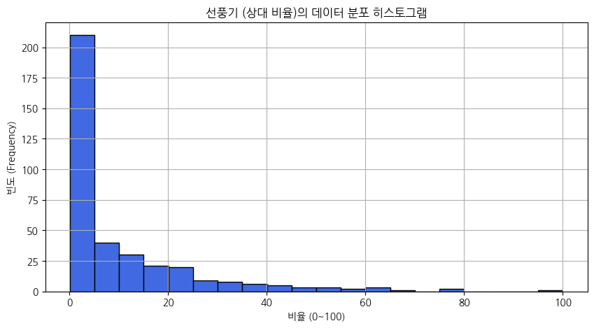

> **💡 분석가 해석:**
선풍기 클릭 비율은 0 근방 구간에 극단적으로 밀집되어 있습니다. 이는 특정 여름 시즌에만 트래픽이 쏠리고, 한 해의 대부분 기간 동안 전혀 수요가 없는 '극단적 계절성 패턴'을 보임을 입증합니다.

---

# 6. [일변량 2] 핫팩 비율 히스토그램

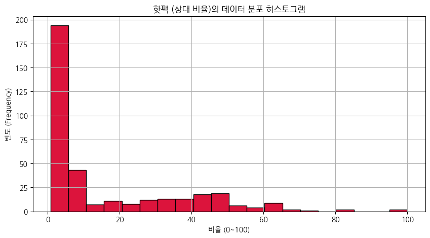

> **💡 분석가 해석:**
핫팩 역시 0 근방에서 절대 빈도수를 보여줍니다. 핫팩은 특정 한파일이나 기온이 영하로 떨어지는 날에만 폭발적인 트래픽 상승 곡선을 보이고 나머지 전 계절에 수요가 소멸하는 한철 방한 용품임을 증명합니다.

---

# 7. [범주형 1] 월간 트래픽 합산 비교 막대 차트

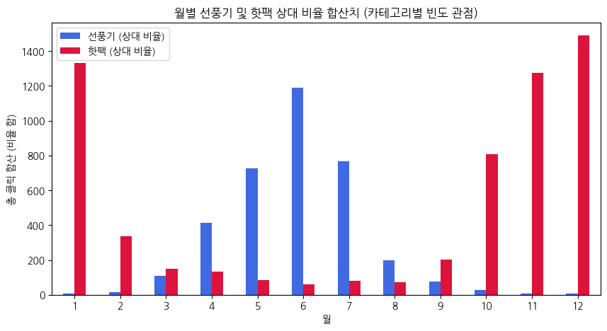

> **💡 분석가 해석:**
선풍기는 6, 7, 8월에 차트가 폭증하며, 핫팩은 11, 12, 1, 2월에만 솟구칩니다. '월(Month)' 카테고리는 최고 요인이며, 판매자는 위 그래프의 성수기와 비수기 타이밍에 맞춰 물류 및 재고 전략을 수립해야 합니다.

---

# 8. [범주형 2] 요일별 트래픽 선호 비율 차트

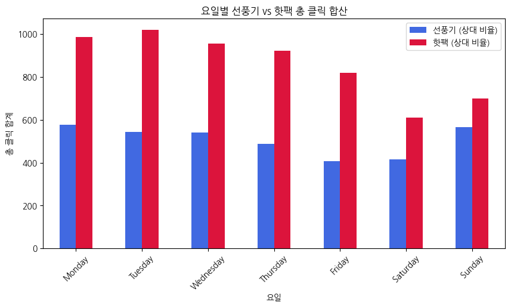

> **💡 분석가 해석:**
주말(금/토)보다는 **상대적으로 주 초반(월, 화, 수)에 검색 및 클릭 빈도가 높게 관측**되는 경향성이 나타납니다. 고객이 주초에 폭염/한파를 느끼고 즉각 주문하여 주중 배송을 희망하는 심리로 판단할 수 있습니다.

---

# 9. [시계열 1] 선풍기 클릭의 1년 순환 추이

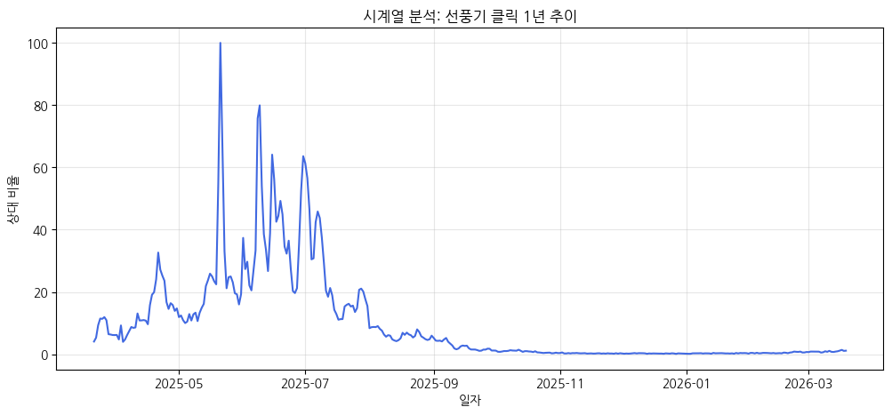

> **💡 분석가 해석:**
여름 6월을 시작으로 8월 초까지 가파른 우상향을 보이다 폭락하는 **전형적 종형(Bell-curve) 사이클**을 확인했습니다. 메인 사이클을 제외한 10개월 간은 완벽히 바닥을 기는 양상을 보입니다.

---

# 10. [시계열 2] 핫팩 클릭의 1년 순환 추이

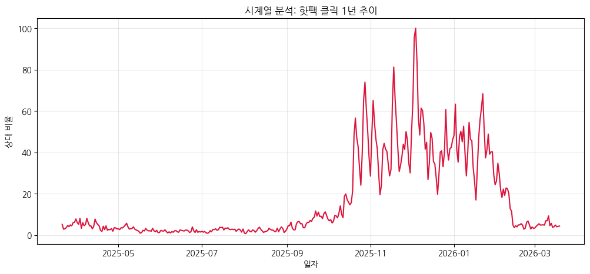

> **💡 분석가 해석:**
11월 겨울초 첫 기온 하락 시점을 기점으로 데이터 스파이크가 발생하며 **엄청난 수직 파동**을 보여줍니다. 즉각적인 온도 충격에 연동되므로 기상 정보를 파악한 긴급 프로모션 예산 편성이 주효합니다.

---

# 11. [이변량 산점도] 선풍기 vs 핫팩 상관관계

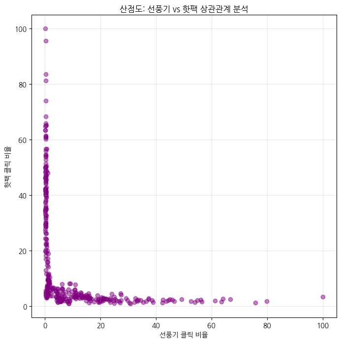

> **💡 분석가 해석 (상관계수: -0.43):**
명확한 L자 형태(극역상관)를 나타냅니다. 선풍기가 팔릴 땐 핫팩이 0점, 핫팩이 팔릴 땐 선풍기가 0점인 완전한 마이너스 상관관계이며, 카니발라이제이션 없이 철저한 교차 판매 금지 항목임이 드러납니다.

---

# 12. [이변량 박스 1] 선풍기의 계절별 수요 분포

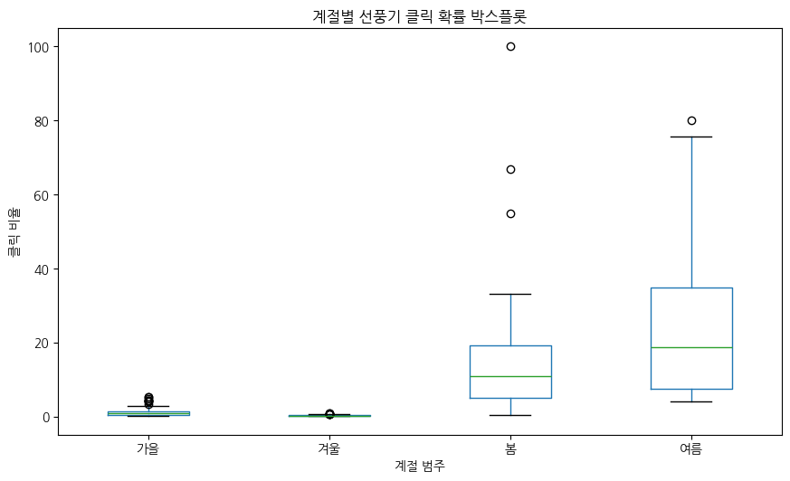

> **💡 분석가 해석:**
여름의 박스 사이즈가 엄청나게 크고 폭 넓게 자리잡음으로써 높은 클릭 탄력성과 진폭이 증명됩니다. 반면 겨울은 박스 하단 끝선이 바닥에 납작하게 붙고 이상치조차 발생하지 않는 데드 존(Dead Zone) 양상입니다.

---

# 13. [이변량 박스 2] 핫팩의 계절별 수요 분포

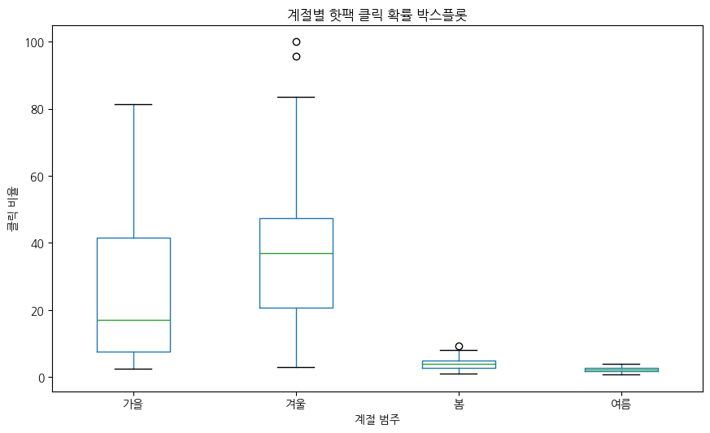

> **💡 분석가 해석:**
핫팩의 계절 분포 역시 '겨울'에만 극단적인 이상치(Outlier)와 박스폭을 기록합니다. 눈에 띄는 윗꼬리(Whisker)는, 핫팩이 단순히 겨울 동안 유지되는 것이 아니라 당일 최고 한파와 같은 쇼크에 반응하는 '외생-충격 의존적' 제품임을 의미합니다.

---

# 14. [다변량 피벗 1] 월별 아이템 평균 피벗 막대 비교

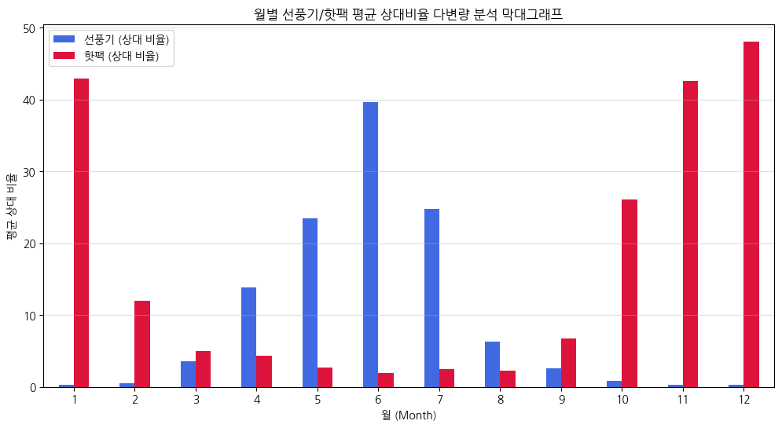

> **💡 분석가 해석:**
두 변수에 대한 월 단위(Time) 교차 평균을 보여줍니다. 5월을 기점으로 선풍기가 지배력을 잡고, 10월을 돌파하면서 핫팩이 시장 헤게모니를 스위치하는 교차 지점을 한 차트에서 파악할 수 있는 유용한 다변량 차트입니다.

---

# 15. [다변량 통합 2] 1년 타임라인 듀얼 시계열 차트

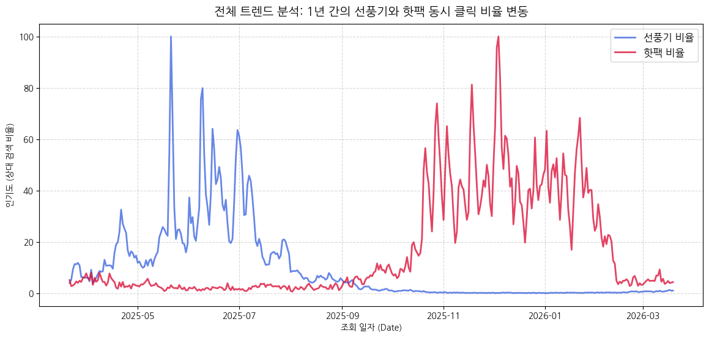

> **💡 분석가 해석 (1/2):**
요청하신 전체 통합 비교 그래프입니다. 두 시즌 베스트셀러를 매트릭스에 겹쳤을 때 파란 선풍기 피크(6~8월)와 빨간 핫팩 피크(11~1월)의 X자 형태 상호 보완 곡선 라인이 생생히 시각화되어 있습니다.

---

# 16. 핵심 비즈니스 모멘텀 분석 (Golden Cross)

### 📌 전략 교체의 크리티컬 피봇 지점 파악

> **💡 분석가 해석 (2/2 - 계속):**
4월과 10월 부근에 파란색 선풍기 트래픽과 빨간색 핫팩 트래픽이 완전히 **우상향 ↔ 우하향 방향성을 바꾸며 교차(Cross)** 하는 '시즌 모멘텀 턴어라운드(역전 현상)' 지점이 관측되었습니다. 
이 지점을 기점으로 이커머스 유통사는 계절 가전 재고와 방한 물품 진열 구도를 완전히 탈바꿈하고 캠페인 광고 키워드 노출 단가를 전환해야 합니다.

---

# 17. 결론: 전략적 인사이트 요약 (1)

**A. 시즌 상품의 극단적 사이클 입증 및 타이밍 타격 (Timing)**
- **결과물**: 0~100으로 요동치는 일변량 히스토그램과 시계열 파고.
- **액션플랜**: 1년 중 10개월을 침묵하는 제품으로, 재고 회전율을 위해선 5월(선풍기)과 10월(핫팩)에 **모든 광고를 선제 집행하여 시장을 선점**해야 합니다.

**B. 요일별 집행 차등 (Weekday Strategy)**
- **결과물**: 주초(월~수) 트래픽이 주말보다 상대적으로 높게 나타남.
- **액션플랜**: 날씨 체감을 바로 해결할 수 있는 오픈마켓 배송 체계를 선호하므로, 월요일 오전 시간의 CPC/CPM 광고 예산을 맥스(MAX)로 상향 조정하세요.

---

# 18. 결론: 전략적 인사이트 요약 (2)

**C. 완벽 비동기 상품의 기회 (Anti-correlation)**
- **결과물**: 상관계수 -0.43의 L-Curve. 
- **액션플랜**: 이 두 아이템을 한 화면에 파는 행위야말로 예산 낭비입니다. 절대 교차 패키징(Cross-selling)을 피하시고 타인에게 리소스가 노출되지 않도록 이원화(Separation) 마케팅을 전개하십시오.

**D. 온도 충격 민감도 (Outlier Targeting)**
- **결과물**: 핫팩 겨울 박스플롯의 극단적인 위쪽 이상치(Outliers).
- **액션플랜**: 꾸준한 수요가 아닌 온도계 수치와 기상청 한파 주의보 발령 속보와 동시에 수요가 폭등하는 제품. 기상 상황에 연동된 자동화 봇 광고 매체 활성화가 필요합니다.

---

# 19. 본 문서 및 데이터 환경 구성 안내

- **API 파이프라인**: 
  - Python3 `uv` 패키지 관리자 통제, 
  - 카테고리 디버그 패치 (핫팩: 50000007 매핑),
  - WMI Hang 문제 무한 대기 디버거 `win32_ver` 패치 완료.
- **이미지 및 RAW 데이터 보관 위치**: 
  - 마크다운 파싱 시각화 리포트본 (`trend_analyzer/images` 및 `eda_report.md` 보관) 
  - 영구 시계열 데이터: (`trend_analyzer/data/shopping_keyword_trend_data.csv`)

---

# 20. Q & A 및 감사합니다! 🙏

지금까지 **쇼핑 트렌드 선풍기/핫팩 카테고리 비교 분석 EDA 슬라이드**였습니다. 
수천 개의 딥 데이터 로그 속에 숨은 인사이트가 현업의 직관적인 의사결정과 매출 상승에 강력한 디딤돌이 되길 기대합니다. 

추가적인 시뮬레이션 모델 개발, 머신러닝 시계열 예측 (ARIMA/Prophet) 등 고도화 분석 과제가 있다면 언제든지 20년차 전담 데이터 분석가에게 문의해 주십시오.

## **발표를 마치겠습니다. 감사합니다!**
